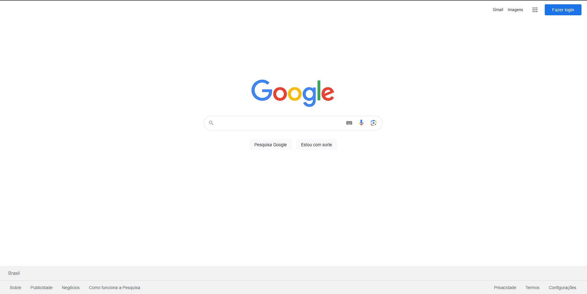

O navegador é um mecanismo de renderização. Sua função é fazer o download de uma página da Web e renderizá-la de forma compreensível para um ser humano, o usuário digita um endereço na barra do navegador e o navegador faz o download do "documento" nesse URL e o renderiza.

Em resumo, o trabalho de um navegador consiste em:

- Resolução de DNS
- Troca de HTTP
- Renderização

## Resolução de DNS

A resolução de DNS garante que, quando o usuário digita um URL, o navegador sabe a qual servidor deve se conectar. O navegador entra em contato com um servidor DNS para descobrir que `google.ae` se traduz em `216.58.207.110`, sendo um endereço IP ao qual o navegador pode se conectar.

## Troca de HTTP

Depois que o navegador identificar o servidor que atenderá à nossa solicitação, ele iniciará uma conexão TCP e começará a **troca de HTTP**. Isso nada mais é do que uma forma de o navegador comunicar ao servidor o que deseja e de o servidor responder de volta.

HTTP é simplesmente o nome do protocolo mais popular para comunicação na Web. Os navegadores se comunicam principalmente via HTTP ao se comunicarem com os servidores. Uma troca de HTTP envolve o cliente, nosso navegador, enviando uma **solicitação** e o servidor respondendo com uma **resposta**.

## Analisando uma solicitação

Por exemplo, depois que o navegador tiver se conectado com êxito ao servidor por trás do google.com, ele enviará uma solicitação parecida com a seguinte:

```http
GET / HTTP/1.1
Host: google.com
Accept: */*
```

Vamos detalhar a solicitação, linha por linha:

- `GET / HTTP/1.1:` com a linha inicial, o navegador solicita ao servidor que recupere o documento no local `/`, acrescentando que o restante da solicitação seguirá o protocolo `HTTP/1.1`. Ele também poderia ter usado `1.0` ou `2`.

- `Host: google.com:` **esse é o único cabeçalho HTTP obrigatório no HTTP/1.1**. Como o servidor pode atender a vários domínios (`google.com`, `google.co.uk`, etc.), o cliente menciona aqui que a solicitação foi feita para esse host específico.

- `Aceitar: */*:` um cabeçalho opcional, no qual o navegador informa ao servidor que aceitará qualquer tipo de resposta. O servidor pode ter um recurso disponível nos formatos JSON, XML ou HTML, portanto, ele pode escolher o formato que preferir.

## Analisando uma resposta

Neste exemplo, o navegador, atuando como cliente, concluiu sua solicitação; agora é a vez de o servidor responder:

```http
HTTP/1.1 200 OK
Cache-Control: private, max-age=0
Content-Type: text/html; charset=ISO-8859-1
Server: gws
X-XSS-Protection: 1; mode=block
X-Frame-Options: SAMEORIGIN
Set-Cookie: NID=1234; expires=Fri, 21-Jul-2023 12:58:35 GMT; path=/; domain=.google.com; HttpOnly

<!doctype html><html">
...
...
</html>
```

Vamos explicar em detalhes.

O servidor nos informa que a solicitação foi bem-sucedida (`200 OK`) e adiciona alguns cabeçalhos à **resposta**;

- Por exemplo, ele anuncia qual servidor processou nossa solicitação (`Server: gws`), qual é a política de `proteção X-XSS` dessa resposta e assim por diante.

Não é necessário entender cada uma dessas informações agora, pois analisaremos o protocolo HTTP, seus cabeçalhos e assim por diante em seus respectivos capítulos. Por enquanto, tudo o que você precisa entender é que o cliente e o servidor estão trocando informações, que fazem isso via HTTP.

## Como um navegador renderiza uma resposta HTTP

Por último, veremos o processo de **renderização**. Qual seria a propósito de um navegador se a única coisa que ele mostrasse ao usuário fosse uma lista de caracteres?

```html
<!doctype html><html>
...
...
</html>
```

No **corpo** da resposta, o servidor inclui a representação da resposta conforme o cabeçalho `Content-Type`. No nosso caso, o tipo de conteúdo foi definido como `text/html`, portanto, esperamos uma marcação HTML na resposta, sendo exatamente o que encontramos no corpo. É aqui que o navegador realmente se destaca: ele analisa o HTML, carrega recursos adicionais incluídos na marcação (por exemplo, pode haver arquivos JavaScript ou documentos CSS a serem buscados) e os apresenta ao usuário o mais rápido possível.

Mais uma vez, o resultado é algo que o usuário comum pode entender:



Para uma leitura mais detalhada do que realmente acontece quando pressionamos Enter na barra de endereço de um navegador, recomendo a leitura de "[What happens when...](https://github.com/alex/what-happens-when)" (O que acontece quando...).

## Apresentando o `cURL`

O [cURL](https://curl.se/), criado por Daniel Stenberg. É um dos programas de software mais populares que os desenvolvedores da Web usam. Ele nos permite fazer uma troca de HTTP em tempo real, enviando uma solicitação HTTP a partir da nossa linha de comando.

```bash
curl -I dev.to
```

No exemplo acima, solicitamos o documento para `dev.to`, e o servidor do dev.to respondeu com sucesso. Em vez mostrar o corpo da resposta na linha de comando, usamos o sinalizador -I para informar ao cURL que estamos interessados apenas nos cabeçalhos da resposta.

Dando um passo adiante, podemos instruir o cURL a mostrar mais algumas informações, incluindo a solicitação real que ele executa, para que possamos ter uma visão melhor de toda a troca HTTP. A opção que precisamos usar é `-v` (verbose).

```bash
curl -I -v dev.to
```

As mesmas informações estão disponíveis nos principais navegadores por meio de suas DevTools. Como vimos, os navegadores nada mais são do que clientes HTTP elaborados. É claro que eles acrescentam um número enorme de recursos, como gerenciamento de credenciais, bookmarking e histórico, mas a verdade é que eles nasceram como clientes HTTP para humanos.

Uma última coisa que eu gostaria que entendêssemos é que qualquer coisa pode ser um navegador. Se você tem um aplicativo móvel que consome APIs por meio do protocolo HTTP, então o aplicativo é o seu navegador. Acontece que ele é um navegador altamente personalizado que você mesmo criou, que só entende um tipo específico de respostas HTTP da sua própria API.
