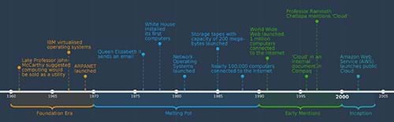
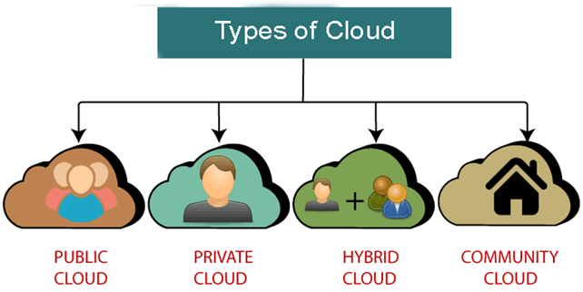

# O que é a nuvem?

### Computação em nuvem

A computação em nuvem é o fornecimento sob demanda de serviços de computação, como servidores, armazenamento, bancos de dados, redes, software, análises e muito mais, pela Internet ("a nuvem"). Isso oferece inovação mais rápida, recursos flexíveis e economias de escala com um modelo de preços de pagamento conforme o uso.

<figure align="center">
    
    <figcaption>
      <code>Camadas e componentes da arquitetura de nuvem</code>
    </figcaption>
</figure>

O modelo de computação em nuvem é uma mudança de paradigma em relação ao modelo de computação tradicional, em que as empresas precisam adquirir o hardware, manter, proteger e atualizar o hardware para manter seus serviços em funcionamento. Com o modelo de computação em nuvem, a complexidade operacional é transferida das organizações para os fornecedores de nuvem que operam as plataformas de nuvem. As empresas se concentram em fornecer valor ao cliente em vez de ficarem atoladas em preocupações operacionais.

Além dos aspectos operacionais, a computação em nuvem oferece muitas outras oportunidades que permitem que empresas e indivíduos criem serviços que antes não eram viáveis. A nuvem acelerou o ritmo da inovação, o que não era possível antes.

### Analogia

Esse modelo de computação é semelhante a um serviço de utilidade pública, como a eletricidade. Quando nos mudamos para uma casa ou um apartamento, pesquisamos para selecionar um dos muitos fornecedores de eletricidade da área, assinamos um contrato com o fornecedor escolhido e recebemos nossa conexão de eletricidade. O governo da cidade já cuidou da infraestrutura para fornecer eletricidade à nossa residência. Nós consumimos a eletricidade para o funcionamento de nossa casa e pagamos a conta.

Da mesma forma, na computação em nuvem, as plataformas de nuvem fornecem serviços semelhantes à infraestrutura principal, que podemos usar para resolver problemas de negócios. Não nos preocupamos em saber como um serviço é fornecido. Escolhemos apenas os componentes necessários e nos concentramos em resolver os problemas.

## Uma breve história da computação em nuvem

### O cenário

Nos primórdios da computação, tínhamos computadores mainframe grandes e caros que exigiam muito espaço e conhecimento especializado para serem operados. Com essas máquinas grandes e caras, surgiu o conceito de compartilhamento de tempo. Alugávamos um intervalo de tempo para executar os cálculos.

O advento dos computadores em rede levou isso mais longe e permitiu que as pessoas acessassem os computadores remotamente e conectassem vários usuários simultaneamente. Isso abriu o caminho para a Internet. Os computadores pessoais (PCs) possibilitaram que as pessoas tivessem computadores e ultrapassaram os mainframes como a forma mais popular de usar computadores.

Juntamente com esses avanços, ganhou popularidade o conceito de máquinas virtuais que funcionam como um computador real com um sistema operacional totalmente funcional. As empresas começaram a alugar máquinas virtuais e redes privadas para seus clientes. Esses avanços nos serviços de Internet e na virtualização levaram ao modelo de computação em nuvem como o conhecemos.

Voltando ao círculo completo, com a computação em nuvem, os provedores de nuvem gerenciam e operam a infraestrutura para executar programas para nós, e nós pagamos pelo uso. A diferença é que temos tecnologia e escala muito mais sofisticadas do que as que os mainframes nos proporcionavam. As plataformas de nuvem atuais podem atender a uma vasta base de clientes e oferecer recursos quase infinitos para executar negócios em escala global.

### A força condutora

Com a World Wide Web, a Internet realmente decolou. Na década de 2000, empresas iniciantes baseadas na Internet estavam sendo criadas a torto e a direito, e a adaptação foi às alturas. Mesmo com o estouro da bolha dos anos 2000, a Internet levou todo o setor a um caminho irreversível, e muitas empresas estavam resolvendo problemas na Internet. Como as empresas começaram a atender a públicos maiores, elas precisavam de uma infraestrutura mais ampla e melhor para fornecer serviços aos seus consumidores.

A escala traz desafios, e muitas empresas têm uma infraestrutura muito maior do que poderiam utilizar em sua capacidade total. As empresas precisavam simplificar sua infraestrutura para se concentrar em fornecer valor aos seus consumidores. Havia uma demanda inexplorada e um problema potencial a ser resolvido.

### Amazon Web Services

Em 2006, a Amazon, a maior livraria do mundo na época, pegou o setor de surpresa ao lançar a plataforma para emprestar seus recursos computacionais ao mercado. Eles lançaram a AWS, que oferece serviços on-line a outros clientes. O Amazon S3 e o EC2 foram os primeiros serviços que a Amazon lançou com o AWS. Por ser a pioneira, a Amazon teve um impacto significativo na formação de todo o setor de computação em nuvem como o conhecemos e ainda é uma das principais plataformas de nuvem do mercado.

### Contexto histórico da computação em nuvem

<figure align="center">
    
    <figcaption>
      <code>A linha do tempo dos principais eventos na história da computação em nuvem</code>
    </figcaption>
</figure>

Depois do AWS, o Google seguiu o exemplo e lançou sua plataforma de computação em nuvem, o GCP, em 2008. A Microsoft foi a última a lançar sua plataforma de nuvem, o Microsoft Azure, que foi disponibilizada ao público em 2010. Além dessas grandes empresas, muitos outros fornecedores estão oferecendo suas plataformas de nuvem no mercado.

A nuvem está prosperando e está em uma tremenda trajetória de crescimento desde sua criação. Toda empresa é uma empresa de software agora e, se não for, será. A computação em nuvem é um mercado de US$ 445 bilhões, com projeção de US$ 1.614 bilhões até 2030. Ela se tornou o padrão de fato para o fornecimento de software em todos os setores. Com a ajuda da tecnologia de computação em nuvem, as empresas estão resolvendo problemas críticos que levariam muito mais tempo e recursos para serem resolvidos.

## Características da nuvem

### Velocidade

Na TI tradicional, geralmente são necessários dias ou semanas, se não meses, para adquirir e fornecer o hardware necessário para executar os serviços. A computação em nuvem reduziu esse tempo para minutos, aumentando drasticamente o ritmo da inovação. Com a computação em nuvem, é possível fornecer os recursos necessários em questão de minutos e de forma totalmente autônoma.

Isso reduz significativamente o tempo de lançamento no mercado, o que pode ser uma enorme vantagem competitiva para as empresas. A velocidade e a agilidade que a TI não tem sido capaz de fornecer resultaram no que muitos chamam de "Shadow IT", em que as unidades de negócios estão recorrendo ao uso de cartões de crédito para adquirir recursos de computação fora do alcance da TI.

### Escala global

As plataformas de nuvem são capazes de atender a um público global. Isso se traduz em recursos quase infinitos que podem ser obtidos em uma plataforma de nuvem. É mais fácil dimensionar os aplicativos para cima e para baixo com base na demanda. Não precisamos nos preocupar com a falta de capacidade ou mesmo com o excesso de provisionamento antecipado, o que não é incomum nos modelos de computação tradicionais. Usamos apenas recursos suficientes para atender aos requisitos de nossa carga de trabalho e aumentamos ou reduzimos os recursos necessários conforme a demanda aumenta ou diminui.

Para atender à demanda, muitas organizações mantêm recursos muito maiores em execução o tempo todo, mesmo que a demanda seja sazonal. Esse problema levou a Amazon a lançar o AWS no mercado.

### Economia

O modelo de computação em nuvem muda do modelo CapEx tradicional para o modelo OpEx. Isso significa que não gastamos toneladas de dinheiro antecipadamente; em vez disso, pagamos apenas pelos recursos que consumimos. Isso economiza imediatamente um capital significativo para as empresas, que pode ser desviado para outras áreas da organização. Devido a esse modelo, está mais fácil do que nunca para as empresas adotarem a nuvem.

### Segurança

A nuvem ajuda a resolver desafios complexos de segurança com os quais as organizações tiveram que lidar por muito tempo. As empresas que gerenciam sua infraestrutura de TI no local geralmente não têm recursos suficientes para investir em segurança, seja em hardware e software ou na equipe necessária com conhecimento especializado suficiente. Isso torna as organizações vulneráveis a ataques e explorações, o que pode ser desastroso para as empresas.

O modelo de computação em nuvem oferece uma melhoria significativa para garantir a segurança geral. Ao aproveitar esse modelo, tiramos proveito dos recursos fornecidos pelo provedor de nuvem e melhoramos nossa postura geral de segurança.

Com o conhecimento dessas características da computação em nuvem, podemos tomar decisões informadas ao projetar soluções em nuvem. Geralmente é uma jornada, e não precisamos necessariamente incorporar todos os aspectos de uma só vez. Todos os aspectos envolvem a diligência e análise para pesar os prós e os contras e escolher o que se aplica ao nosso caso de uso.

## Tipos de modelos de implantação de nuvem

As plataformas de nuvem evoluíram para atender às diversas necessidades de indivíduos, empresas e governos. Os fornecedores de nuvem oferecem diferentes tipos de nuvem para atender a uma base de clientes mais ampla. Essa abordagem permite que os fornecedores de nuvem atendam aos clientes onde quer que eles estejam, em vez de empurrá-los para um único modelo.

<figure align="center">
    
    <figcaption>
      <code>The cloud delivery models</code>
    </figcaption>
</figure>

### Públicas

As **nuvens públicas** são de propriedade e operadas por provedores de serviços em nuvem terceirizados que fornecem recursos de computação, como armazenamento, computação, etc., pela Internet. Com esse modelo, os provedores de serviços em nuvem podem fornecer uma enorme capacidade de recursos para executar cargas de trabalho para muitos clientes em um modelo compartilhado. Podemos pensar nisso como um provedor de serviços públicos, como eletricidade. Os consumidores obtêm conexões por meio da infraestrutura compartilhada. Essa é a oferta de nuvem mais comum e a mais simples de integrar. Devido à natureza do modelo compartilhado, é também o modelo mais econômico.

Mesmo que os recursos sejam fornecidos em um modelo compartilhado, a segurança é garantida. Só vemos os dados e os recursos aos quais temos acesso. Com a ajuda de um pool compartilhado de recursos, as plataformas de nuvem podem otimizar seus recursos para atender a muitos clientes em vez de selecionar alguns e, por sua vez, repassar os benefícios da economia de custos aos consumidores.

Plataformas como Microsoft Azure, Amazon Web Services e Google Compute Platform são os principais exemplos de nuvens públicas.

### Privada

A **nuvem privada** está no espectro oposto, em que uma organização usa todos os recursos exclusivamente. É um ambiente dedicado para uma organização específica. É semelhante a um modelo tradicional de execução de infraestrutura. No entanto, os últimos avanços tecnológicos, como virtualização, gerenciamento de aplicativos e automação, são usados para facilitar o gerenciamento das operações.

As nuvens privadas podem ser de dois tipos:

- **Hospedadas**: Elas são oferecidas por um provedor de nuvem terceirizado.

- **Nuvens privadas internas**: São mantidas internamente por uma organização.

O benefício significativo da nuvem privada é que ela oferece às organizações mais controle sobre segurança, privacidade de dados e conformidade. Os clientes ainda podem se beneficiar dos recursos da nuvem, como autoatendimento, escalabilidade e elasticidade. Como se trata de um ambiente dedicado que exige recursos dedicados, o custo é significativamente maior do que o da nuvem pública. Esse pode ser o modelo mais caro para operar.

O Helion Managed Private, o Microsoft Azure Stack e o Red Hat OpenShift são alguns dos produtos no espaço da nuvem privada.

### Híbrida

A **nuvem híbrida** é uma combinação de pública e privada, em que alguns recursos são hospedados na nuvem pública e outros continuam a ser executados em um ambiente local. As organizações costumam usar esse modelo para estender sua infraestrutura local para a nuvem, a fim de aproveitar as ofertas de nuvem e, ao mesmo tempo, manter seus aplicativos e sistemas de linha de negócios internamente. Essa opção permite que as organizações mantenham seus dados em suas redes privadas e internas, que podem ser acessadas por serviços executados na nuvem pública de forma controlada e segura.

O modelo híbrido está ganhando cada vez mais popularidade, e essa é a realidade que muitas empresas enfrentam. As empresas fizeram investimentos maciços em seus aplicativos de linha de negócios ao longo dos anos, que são de missão crítica e, muitas vezes, confidenciais. Portanto, nem tudo pode ser transferido para a nuvem. Essa abordagem permite que elas sejam ágeis e adotem a nuvem em seu próprio ritmo. Para os fornecedores de nuvem, essa também é uma maneira lucrativa de atrair mais clientes.

O modelo de nuvem híbrida vem com suas complexidades do ponto de vista da infraestrutura, que geralmente envolve a conexão segura dos ambientes locais dos clientes às plataformas de nuvem. Azure Stack, Azure Arc, AWS Outpost e Google Anthos são alguns exemplos das nuvens híbridas disponíveis.

### Nuvem comunitária

Até agora, discutimos modelos de nuvem como pública, privada e híbrida. Esses modelos se aplicam a organizações individuais. No entanto, no mundo real, temos situações em que as empresas que trabalham em determinados setores têm requisitos comuns. Veja o exemplo dos bancos. Eles precisam atender aos requisitos operacionais e regulatórios, que se aplicam a todos os bancos. Agora imagine que cada banco tenha que configurar seu ambiente de nuvem para atender a todos os seus requisitos regulamentares. Embora certamente seja possível, é ineficiente e caro. Além disso, optar pela rota da nuvem pública pode não ser viável por motivos de segurança e conformidade. A configuração de uma nuvem privada pode ser cara e fora do alcance das pequenas e médias empresas.

Para resolver esses desafios, temos a noção de nuvens comunitárias. Nesse modelo, as organizações se associam para configurar um ambiente de nuvem compartilhado entre elas. Em geral, elas compartilham requisitos semelhantes de segurança, privacidade, desempenho e conformidade. A nuvem é configurada de modo que todas as empresas operacionais possam aproveitar o trabalho, em vez de cada empresa definir suas práticas e políticas. Isso a torna muito mais eficiente e econômica para as empresas.

As nuvens comunitárias são usadas por muitas empresas, como bancos, setores de saúde e educação e até mesmo governos.

### Nuvens governamentais

A nuvem governamental é um tipo de nuvem comunitária. Enquanto todas as outras empresas estão aproveitando o modelo de computação em nuvem para economizar custos e ganhar flexibilidade, os governos não são diferentes. No entanto, os governos geralmente têm requisitos rigorosos de segurança, conformidade e regulamentação. Isso geralmente significa que eles não podem simplesmente usar serviços de nuvem pública para executar suas cargas de trabalho.

Para resolver esse desafio, os fornecedores de nuvem fornecem ofertas de nuvem dedicadas que atendem a critérios rigorosos para governos. Eles fornecem modelos de serviços em nuvem baseados nas mesmas tecnologias que sustentam as nuvens públicas, mas oferecem proteção adicional aos usuários.

Quase todos os principais fornecedores de nuvem têm ofertas para o governo (por enquanto, para o governo dos EUA). A Amazon tem o AWS GovCloud (EUA), o Google oferece o Google Cloud para o governo federal e a Microsoft tem o Azure para o governo dos EUA.

Os fornecedores de nuvem podem fornecer esse nível de produtos e serviços aos governos, configurando regiões dedicadas e acrescentando camadas adicionais de proteção para garantir que as agências governamentais possam confiar nos serviços fornecidos a elas.

### Múltiplas nuvens

A multinuvem é uma estratégia em que as empresas podem usar serviços em nuvem de mais de um provedor de serviços em nuvem. Pode ser que uma empresa esteja usando o pacote de aplicativos Microsoft Office 365 e o Zoom ou o Salesforce. No entanto, muitas vezes, no ambiente corporativo, a multinuvem significa executar a plataforma como serviço (PaaS) ou a infraestrutura como serviço (IaaS) de vários provedores de serviços em nuvem, como AWS, GCP ou Azure. Há prós e contras nessa abordagem.

**Pros**:

- It is reliable.

- It has low vendor lock-in.

- It is potentially cost-saving.

**Cons**:

- It has high operational complexity.

- It has high latency.

## Principais provedores de serviços em nuvem

A computação em nuvem é um mercado em crescimento, e há uma infinidade de empresas que oferecem plataformas de nuvem com muitos serviços e soluções inovadoras de ponta para atrair clientes. Algumas dessas plataformas são significativas em tamanho e lideram os mercados, enquanto outras estão capturando o mercado lentamente. Vamos dar uma olhada em alguns dos grandes participantes do mercado.

### Provedores de primeiro nível

Esses são os provedores de serviços em nuvem que detêm a maioria do mercado e são claramente líderes quando se trata de serviços em nuvem.

#### Amazon Web Services, também conhecido como AWS da Amazon

A Amazon popularizou o conceito de computação em nuvem ao introduzir a plataforma Amazon Web Services (AWS) em 2006. Por ser a pioneira, a AWS conseguiu conquistar uma boa reputação e, com frequência, é a primeira opção de muitas empresas de pequeno e grande porte ao decidir sobre a plataforma de nuvem. O AWS é o principal provedor de serviços em nuvem, capturando cerca de 33% da participação de mercado.

#### Microsoft Azure da Microsoft

Ocupando a segunda posição em relação à AWS, o Microsoft Azure foi lançado inicialmente em 2008 e oficialmente em 2010. O Microsoft Azure captura cerca de 22% da participação de mercado e cresce consistentemente a cada ano. A Microsoft tem uma enorme base de clientes corporativos e é, sem dúvida, a principal plataforma de nuvem escolhida. Mais de 95% das empresas da Fortune 500 estão usando a plataforma de nuvem do Microsoft Azure atualmente.

#### Google Cloud Platform, também conhecido como GCP da Google

Embora a GCP tenha sido lançada antes da Microsoft em 2008, ela não conseguiu obter tanta participação de mercado em relação à AWS e à Microsoft. O Google comanda cerca de 10% da participação de mercado.

### Provedores de segundo nível
Além dos principais participantes, há inúmeras outras empresas que fornecem plataformas de nuvem. Alguns outros fornecedores populares de nuvem (não em uma ordem específica) são os seguintes:

- IBM Cloud
- Alibaba Cloud
- Oracle Cloud
- Tencent cloud
- Salesforce

- Serviços de nuvem 

As plataformas de nuvem têm centenas de serviços em seu portfólio, e listar todos os serviços levaria muito tempo. No entanto, os serviços são semelhantes em todas as plataformas. Por exemplo, se estivermos trabalhando com um serviço específico do AWS, provavelmente encontraremos um serviço semelhante no Microsoft Azure. As plataformas dividem esses serviços em categorias, o que facilita a compreensão e a navegação. Portanto, sempre que estivermos analisando qualquer serviço de plataforma de nuvem, geralmente é mais fácil prever a categoria para encontrar um serviço no qual estamos interessados.

Aqui está uma lista de produtos e serviços para várias plataformas de nuvem: [AWS](https://aws.amazon.com/products/?hp=tile&so-exp=below&aws-products-all.sort-by=item.additionalFields.productNameLowercase&aws-products-all.sort-order=asc&awsf.re%3AInvent=*all&awsf.Free%20Tier%20Type=*all&awsf.tech-category=*all), [Azure](https://azure.microsoft.com/en-us/products/), [GCP](https://cloud.google.com/products), [AliCloud](https://www.alibabacloud.com/product), [IBM](https://www.ibm.com/au-en/cloud/products) e [Oracle Cloud](https://www.oracle.com/au/cloud/what-is-cloud-computing/cloud-services/).

## Como funciona a nuvem?

### Visão geral em alto nível

Em um nível elevado, as plataformas de nuvem fornecem uma maneira de interagir com suas plataformas, geralmente por meio de um painel e APIs. Podemos usar qualquer uma das opções para criar os recursos necessários, fazer deploy do nosso código e disponibilizar nossos serviços para que os consumidores possam acessá-los pela Internet.

### Criação de recursos de nuvem

Vamos imaginar que criamos um site que mostra uma lista dos DEAs mais próximos com base na localização dos visitantes. Para esse site, precisamos de recursos de computação, como uma máquina virtual, um armazenamento de dados para salvar os locais atuais e novos, e conectividade com a máquina virtual (VM) para que seja acessível pela Internet.

Com o site pronto, como podemos levá-lo aos usuários finais com a ajuda da nuvem?

Podemos fazer deploy (ou hospedar) esse site em uma plataforma de nuvem como o Microsoft Azure. Há várias opções, mas, para este exercício, usamos o painel fornecido pelo Microsoft Azure para criar uma VM e um banco de dados, configurar a rede necessária e publicar o código-fonte. O site está pronto e funcionando em poucos cliques, e obtemos um URL para acessar o site pela Internet. Com esse URL, qualquer pessoa pode acessar o site em todo o mundo. À medida que nosso pequeno site se torna popular, o tráfego aumenta com o tempo. Com o aumento do tráfego, o site exige mais recursos para se manter atualizado.

À medida que a base de usuários aumenta, nosso site continua a crescer e a atender ao público onde quer que ele esteja. Como o site está sendo executado na nuvem, podemos aproveitar ao máximo a escalabilidade que a nuvem oferece. Podemos ajustar os recursos necessários para tornar o site disponível para qualquer pessoa que o visite e lidar com a crescente demanda. Adicionar e remover recursos sob demanda torna-se uma maneira econômica de operar o site. Não há necessidade de fazer nada manualmente, pois isso pode ser totalmente automatizado.

### Como isso funciona?

Os provedores de nuvem fornecem painéis e APIs para interagir com suas plataformas. As APIs são importantes porque nos permitem criar ferramentas e configurar a automação para realizar a maioria das operações. Podemos usar as APIs para enviar solicitações para fornecer o recurso necessário, como uma VM ou um banco de dados, etc. A plataforma de nuvem recebe essa solicitação e identifica a região, a zona de disponibilidade, o data center e o rack de servidor adequado para criar os recursos solicitados. Recebemos a confirmação quando os recursos são fornecidos e podemos acessá-los. Esse processo é realizado pelo software que as plataformas de nuvem gerenciam, e podemos interagir com ele por meio de APIs.

### Design das plataformas de nuvem

Os fornecedores de nuvem criam suas plataformas para atender a um público global. Seus data centers estão espalhados por todo o mundo para oferecer escalabilidade, confiabilidade, robustez e alta disponibilidade. Esses são alguns dos princípios fundamentais sobre os quais as plataformas de nuvem são construídas. É essencial ter em mente que os fornecedores de nuvem atendem a públicos diversos e mais amplos em todo o mundo. Por isso, eles criam uma plataforma genérica que pode atender aos requisitos e às demandas de sua base de clientes.

A maneira como os fornecedores de nuvem projetam suas plataformas varia, é claro, mas aqui está uma abordagem de projeto fundamental que todos os principais fornecedores de nuvem adotam para construir suas plataformas:

### Região

Uma região representa um local geográfico no mundo que foi projetado para ser isolado de outras regiões. O design de várias regiões ajuda a lidar com falhas regionais. Ele oferece a tolerância a falhas e a estabilidade necessárias para operar serviços em escala global. As regiões são conectadas com redes dedicadas de alta largura de banda para proporcionar baixa latência. Normalmente, as regiões têm três zonas de disponibilidade.

### Zona de disponibilidade (AZ)

A zona de disponibilidade protege nossos aplicativos contra falhas no data center. É um local fisicamente separado em uma região que é tolerante a falhas locais. Ela tem energia, rede, resfriamento e segurança física independentes e é conectada por meio de uma rede redundante de latência ultrabaixa.

Diferentes AZs são conectados entre si para oferecer baixa latência, alta taxa de transferência e conexões de rede redundantes. Com essa abordagem, os clientes podem operar aplicativos em nível de produção que são mais altamente disponíveis, tolerantes a falhas e dimensionáveis do que em um design de data center único. Todo o tráfego entre AZs é criptografado. A zona de disponibilidade pode conter um ou mais data centers.

Há várias outras opções para implantar recursos de forma redundante para melhorar a disponibilidade e a resiliência em caso de falhas. Muitos serviços básicos são, por padrão, replicados em vários servidores para garantir a durabilidade. Isso varia de nuvem para nuvem e de seu design específico, mas o princípio permanece o mesmo.

### Data center

Um data center é um edifício, um espaço dedicado dentro de um edifício ou um grupo de edifícios usados para abrigar sistemas de computador e componentes associados, como sistemas de telecomunicações e armazenamento.

### Zonas estendidas ou locais

As zonas estendidas ou locais são a extensão de regiões adequadas para aplicativos sensíveis à latência, como jogos em tempo real, streaming de mídia, aprendizado de máquina etc. Elas fornecem recursos de nuvem próximos aos usuários finais em cidades densamente povoadas ou em áreas mais distantes das regiões. Eles também fornecem alta largura de banda e uma conexão segura entre as cargas de trabalho locais e aquelas executadas na região.

## Onde a nuvem é usada?

Vamos ver alguns exemplos de nossas atividades diárias para entender o uso da nuvem. Acordamos com um alarme em nosso celular, nos pesamos em uma balança inteligente, assistimos às notícias em nossa smart TV, nos comunicamos com nossos colegas pelo Microsoft Teams, usamos o Gmail para nossos e-mails ou usamos plataformas como o dev.to para nos mantermos atualizados com o cenário técnico.

Nossas vidas são impulsionadas pela tecnologia, e o facilitador da maioria dessas atividades é a nuvem. A computação em nuvem está tão incorporada em nossas vidas que nem nos damos conta disso.

### Quem mais está usando a nuvem?

Como você deve ter adivinhado pelos exemplos acima, a maioria dos serviços que mencionamos é fornecida por meio de plataformas de nuvem. Netflix, Amazon Prime, Gmail, Spotify, Uber, WhatsApp, iCloud e GitHub são alguns nomes conhecidos de serviços que a maioria de nós usa diariamente. Cada um desses serviços é executado em diferentes plataformas de nuvem. Um aspecto importante a ser considerado é que essas empresas de bilhões de dólares que operam em escala global não gerenciam seus próprios data centers ou hardware físico para atender a seus clientes. Elas se concentram em seus negócios e garantem a melhor experiência do cliente, deixando a tarefa de executar e manter os serviços para os fornecedores de nuvem.

Muitos desses nomes têm aumentado exponencialmente sua base de usuários desde o início, e a nuvem tem sido o principal facilitador desse crescimento. Ao aproveitar o poder da nuvem, eles têm atendido consistentemente mais clientes ao longo desses anos e têm aprimorado seus serviços para manter seus clientes satisfeitos e seus negócios saudáveis e em crescimento.

### Alguns casos de uso da nuvem

Se observarmos alguns outros casos de uso em que a nuvem está em uso, os seguintes cenários vêm à mente:

### Fornecimento de software e serviços

Atualmente, a nuvem funciona como um padrão de fato para a entrega de serviços de software. Ela reduz o atrito logístico e facilita o trabalho dos provedores de serviços e dos consumidores.

### Streaming de áudio e vídeo

A escala e o poder de computação das plataformas de nuvem facilitaram a transmissão de serviços de áudio e vídeo pela Internet, proporcionando aos consumidores uma ótima experiência. Ao usar tecnologias como redes de fornecimento de conteúdo, os fornecedores de nuvem reduziram a latência do fornecimento de conteúdo aos usuários finais. Netflix, Spotify, Apple Music, Amazon Prime, etc., tornaram-se nomes conhecidos, e seria difícil consumir mídia em qualquer outro formato atualmente.

### Aplicativos nativos da nuvem

A nuvem continua a impactar tremendamente o desenvolvimento e o fornecimento de aplicativos devido à sua escalabilidade e ao custo inicial mais baixo. A elasticidade da nuvem permite que os desenvolvedores dimensionem seus aplicativos conforme a demanda aumenta. As plataformas de nuvem fornecem serviços essenciais que formam a base de muitos aplicativos modernos que criamos. A facilidade de acesso a esses serviços robustos fundamentais torna os desenvolvedores produtivos tanto na fase de desenvolvimento quanto na fase operacional.

### Armazenamento, backup e recuperação de dados

Como estamos transferindo cada vez mais trabalho para plataformas de nuvem, faz sentido usar serviços de armazenamento em nuvem para nossas necessidades de armazenamento, backup e recuperação de dados. A nuvem oferece serviços de armazenamento baratos, confiáveis e robustos.

### Análise de dados, aprendizado de máquina e cargas de trabalho baseadas em IA

Os dados são o novo petróleo, e a nuvem é o facilitador para a mineração desse petróleo na economia digital. Com a enorme quantidade de dados gerados diariamente, precisamos de ferramentas e recursos econômicos, eficientes e rápidos que possam ajudar as empresas a explorar esses dados e obter insights a partir deles. Essa análise pode ajudar as empresas não apenas a proteger seus clientes, mas também a inovar e oferecer melhores serviços aos consumidores. A nuvem oferece a escala, a eficiência e os recursos econômicos que as empresas podem usar para obter vantagens competitivas.

## Desvantagens da nuvem

Sempre há dois lados em tudo. Até agora, aprendemos sobre a computação em nuvem, sua história, como ela funciona, benefícios, casos de uso, etc. Agora, vamos falar sobre as desvantagens ou inconvenientes da computação em nuvem.

Aqui estão alguns dos pontos que precisamos considerar. Não se trata necessariamente de desvantagens ou inconvenientes, mas de coisas das quais precisamos estar conscientes. Se tivermos esses pontos em mente, poderemos nos concentrar nos aspectos positivos da computação em nuvem.

### Custo

Ao projetar qualquer solução de nuvem, precisamos considerar o custo. O fato de executarmos nossas cargas de trabalho na nuvem não significa que ela será mais barata. Essa é uma parte essencial do projeto da solução. As plataformas de nuvem oferecem vários serviços porque fornecem uma plataforma genérica que pode ser usada para resolver vários cenários. É nosso trabalho, como arquitetos de soluções, escolher o serviço certo com base em nosso caso de uso que seja econômico, dimensionável, resiliente e robusto.

O bom é que quase todos os fornecedores de nuvem fornecem uma calculadora de preços ou um estimador que podemos usar para calcular o custo da solução proposta.

Dependendo do caso de uso, executar toda ou parte da carga de trabalho fora da nuvem pode ser mais econômico. As nuvens híbridas são viáveis porque muitas empresas investiram em sua infraestrutura local e não querem migrar tudo para a nuvem completamente. Além disso, por motivos de conformidade, elas podem nem mesmo mover todas as suas cargas de trabalho para a nuvem. Uma nuvem híbrida permite que eles continuem executando alguns serviços no local e transferindo outros para a nuvem.
Dependendo do caso de uso, a execução de toda ou parte da carga de trabalho fora da nuvem pode ser mais econômica. As nuvens híbridas são viáveis porque muitas empresas investiram em sua infraestrutura local e não querem migrar tudo para a nuvem completamente. Além disso, por motivos de conformidade, elas podem nem mesmo mover todas as suas cargas de trabalho para a nuvem. Uma nuvem híbrida permite que elas continuem executando alguns serviços no local e transferindo outros para a nuvem.

### Segurança e dados confidenciais

A segurança tem sido um tópico de discussão desde o advento da computação em nuvem. Todos nós já ouvimos falar de muitas histórias de violação de dados na última década. Seja na Adobe, no Facebook, no Twitter ou no LinkedIn, a maioria das empresas já sofreu violações de dados em algum momento. A segurança é tão difícil quanto parece.

As violações de dados geram uma falta de confiança nas plataformas. Por causa disso, muitas organizações acreditam que é melhor executar as coisas no local, onde têm controle total. Outras organizações relutam em hospedar dados na nuvem por motivos políticos e de conformidade. Do outro lado do espectro, algumas cargas de trabalho, como defesa e governo, lidam com dados confidenciais que não podem ser colocados na nuvem.

Com relação à segurança dos dados, quase todos os fornecedores de nuvem trabalham com o modelo de responsabilidade compartilhada([Shared Responsibility Model](https://cloudsecurityalliance.org/blog/2020/08/26/shared-responsibility-model-explained/)). Isso significa que a responsabilidade do provedor de nuvem varia conforme o modelo de serviço de nuvem escolhido. As plataformas de nuvem nos fornecem as ferramentas e os recursos necessários que podemos usar para manter nossos dados seguros.

É difícil igualar o nível de investimento, o talento e o compromisso dos fornecedores de nuvem com a segurança de suas plataformas. Todas as principais plataformas de nuvem são operadas por pessoas altamente especializadas, responsáveis por executá-las da melhor forma possível. As plataformas de nuvem investem muito e gastam muita energia para obter todas as certificações necessárias. Está comprovado que os fornecedores de nuvem gerenciam a segurança melhor do que qualquer organização padrão.

Os fornecedores de nuvem estão oferecendo alternativas que atendem aos clientes onde quer que eles estejam. Uma nuvem híbrida é uma opção para os clientes manterem algumas cargas de trabalho no local e outras na nuvem. Os clientes podem definir redes privadas para se conectar a seus sistemas, de modo que o tráfego não atravesse a Internet pública. Podemos até mesmo ter uma configuração de nuvem privada em que aproveitamos os serviços dos fornecedores de nuvem, mas tudo está totalmente sob nosso controle. É claro que esses modelos têm um custo, mas será difícil não encontrar uma solução viável que se adapte ao nosso caso de uso.

### dependência do fornecedor

A **dependência do fornecedor** é uma situação em que o cliente fica preso a um fornecedor específico porque o custo de mudar para um fornecedor diferente é muito alto, mesmo que o cliente não esteja satisfeito com a qualidade do serviço oferecido.

Isso pode ser uma preocupação séria para uma empresa devido a vários motivos, conforme indicado abaixo:

- A qualidade do serviço pode se deteriorar ou não atender aos requisitos da empresa.

- Um fornecedor pode alterar substancialmente o serviço de modo que ele não atenda mais às necessidades da empresa.

- Um fornecedor pode descontinuar o serviço.

- O fornecedor aumenta o preço a ponto de não fazer sentido econômico para as empresas.

**O que pode ser feito para contornar o vendor lock-in?**

- Pensar bem antes de decidir qual plataforma ou serviço escolher.

- Adotar uma estratégia de várias nuvens.

- Mantenha backups de dados e execute restaurações frequentes para garantir que os backups funcionem.

### Mudança de paradigma

As plataformas de nuvem oferecem uma ampla variedade de serviços em quase todas as categorias. Para realmente tirar proveito da computação em nuvem, precisamos aprender e nos adaptar a um conjunto diferente de práticas que permitam dimensionar nossos aplicativos quando necessário. Com todos os avanços tecnológicos, não podemos simplesmente continuar a criar os aplicativos de software tradicionalmente, pois deixaremos muita coisa de lado se seguirmos esse caminho.

Aqui estão algumas coisas que precisamos ter em mente quando projetamos soluções para a nuvem:

#### Microsserviços

Crie serviços menores e modulares responsáveis por uma única função no aplicativo de negócios em vez de criar o aplicativo inteiro como um monólito de difícil manutenção.

#### Monitoramento

Os aplicativos em nuvem podem ter muitas peças móveis devido à natureza dos padrões e práticas que usamos que são adequados para aproveitar as vantagens da computação em nuvem. Com muitas peças móveis, o monitoramento torna-se um aspecto essencial para o bom funcionamento do aplicativo.

#### Escalabilidade e confiabilidade

Ao criar aplicativos para plataformas de nuvem, precisamos ter em mente a escala. O que costumava funcionar com aplicativos tradicionais que atendiam a uma base de clientes menor pode não funcionar para a escala global que a nuvem permite. Especialmente com abordagens modernas de arquitetura de software, como os microsserviços, cada serviço é independente e pode ser dimensionado por conta própria. Precisamos de um bom entendimento desses conceitos para garantir que nosso aplicativo e todos os seus serviços sejam executados de forma confiável e tenham a escalabilidade necessária.

#### Disponibilidade

Ao adotar o paradigma da computação em nuvem, precisamos garantir que nossos aplicativos estejam disponíveis para os clientes sempre que eles os acessarem de qualquer lugar. Além disso, se adotarmos uma arquitetura de aplicativos moderna, como microsserviços, será ainda mais importante garantir que todos os serviços estejam funcionando conforme o esperado. A falha de alguns serviços não torna o aplicativo inteiro inútil.

## Por que devemos usar a nuvem?

Há muitos motivos para usar a computação em nuvem, dependendo de sua função e do problema em questão. Não existe uma resposta única para essa pergunta.

Essa é uma área em que a maioria do trabalho está acontecendo, independentemente de nossa função, caso de uso ou setor. A nuvem é o facilitador do nosso mundo moderno e a força motriz para que muitas empresas melhorem seus resultados. O tamanho geral do mercado atual de computação em nuvem é de cerca de US$ 445 bilhões e a projeção é de aproximadamente US$ 1.614 bilhões até o ano de 2030. Como podemos ver, esse nível de potencial de crescimento significa que muitas empresas estão transferindo seus negócios para a nuvem ou o farão eventualmente. Isso significa que muitas oportunidades de trabalho serão abertas para aqueles que quiserem trabalhar com essa tecnologia no futuro.

Se você é desenvolvedor, engenheiro de software, arquiteto de soluções, engenheiro de DevOps ou até mesmo engenheiro de confiabilidade de site, a maioria das organizações em que você trabalha ou deseja trabalhar está executando suas cargas de trabalho e software na nuvem. Se não estiverem, provavelmente estão no processo de migração ou adotando uma plataforma de nuvem.

Há grandes chances de que você esteja lidando com a nuvem de alguma forma. Para exercer uma função técnica, o conhecimento prático da nuvem é quase essencial nos dias de hoje.