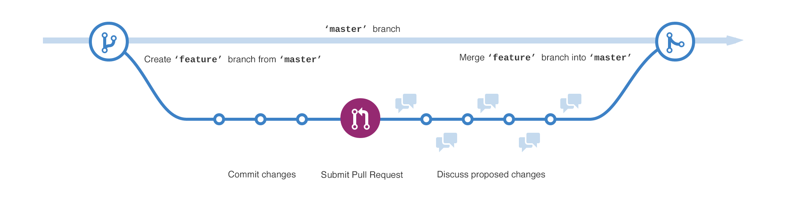

# O que é o Git e por que usá-lo?

Discutiremos os conceitos básicos do controle de versão com o git!

## O que é controle de versão?

Gerenciar os arquivos do seu projeto. Por exemplo, ao criar um site, você terá muitos arquivos, como CSS, HTML, JS e imagens.

## O que é o Git?

O Git é o sistema de controle de versão mais popular do mundo.

## Por que o Git?

O Git mantém um histórico completo das alterações feitas em qualquer projeto, torna a colaboração mais simples e mais produtiva e permite trabalhar em vários recursos ao mesmo tempo.

## Histórico

O Git mantém o registro de todas as alterações que fazemos em nosso projeto. Suponha que você altere parte do CSS e o layout fique ótimo, mas, alguns meses depois, essa alteração faz com que o layout seja interrompido em algumas páginas. Em vez de ter que lembrar o que foi alterado há alguns meses, o Git teria um registro de exatamente quais linhas foram removidas/adicionadas/modificadas, o que facilita muito a correção do problema. Além disso, você pode reverter as alterações com o Git. Nada se perde ou é definitivo.

## Colaboração

O Git facilita muito a colaboração em uma equipe e aumenta a produtividade.

Suponha que você e um membro da equipe estejam trabalhando juntos em algum código HTML. Em um cenário sem o Git, você escreveria a sua parte do código, enviaria o arquivo por e-mail para ele; ele escreveria a parte dele e o enviaria de volta para você. Entretanto, enquanto eles estiverem fazendo a parte deles, você não poderá continuar trabalhando no código. Se o fizer, terá de descobrir o que exatamente o colega de equipe alterou quando o enviou de volta para você e, de alguma forma, mesclar isso no seu arquivo com o novo código. Essa busca por alterações e merge não é apenas um trabalho tedioso, mas está sujeito a erros humanos. Além disso, o tempo gasto fazendo isso pode ser gasto de forma mais produtiva na escrita de código. A boa notícia é que o Git gerencia essas alterações e as mescla para você, de modo que você e vários membros da equipe podem trabalhar em projetos simultaneamente sem precisar se preocupar com a exclusão acidental do trabalho de outra pessoa ou com a merge incorreta.

## Branches(Ramificações) de recursos

O Git permite que você trabalhe e envie vários recursos simultaneamente. Por exemplo, suponha que você queira atualizar a aparência da barra de navegação do seu site e adicionar um recurso que permita que os usuários comentem as suas postagens. Esses são recursos separados: a nova barra de navegação e os comentários. Agora, em uma situação sem Git, se você começar a trabalhar nos dois recursos e terminar a barra de navegação em uma semana, mas precisar de mais três semanas para ativar os comentários, não será possível ativar a barra de navegação até que o recurso de comentários também esteja concluído. Portanto, você teria que trabalhar nos recursos sequencialmente se quiser colocá-los em funcionamento à medida que forem concluídos, o que significa uma perda de produtividade.

O Git, no entanto, tem a capacidade de criar branches separadas para cada recurso. Essas branches podem ser trabalhadas simultaneamente e, quando concluídas, podem ser mescladas de volta à branch principal.

## Git no mercado

O Git é o padrão do mercado, e a maioria dos empregadores presume que você seja bem versado em Git se estiver se candidatando a um emprego na área de software. Além disso, ele pode tornar seu tempo mais produtivo e menos propenso à perda de dados, mesmo que você esteja trabalhando sozinho.

## Jargão do Git

O Git usa um vocabulário muito específico, e a familiaridade com ele facilitará a comunicação com os membros da sua equipe e com a comunidade on-line. Aqui estão alguns termos comuns,

## Repository

Para simplificar, um projeto é um repository. Os repositórios ou "repos" do Git contêm todo o código e o histórico de versões de um determinado projeto.

## Working directory

O Working directory é a pasta em seu computador local onde o projeto existe. O Git rastreia todas as alterações feitas nessa pasta.

## Commit

O Git não salva ou armazena nenhuma alteração feita nos arquivos dentro do diretório de trabalho até que você faça o "commit". Os commits salvam as alterações que você fez no próprio Git.

## Staging

Suponha que você tenha feito alterações em 8 arquivos no diretório de trabalho, mas queira confirmar apenas 4 deles porque os outros 4 apresentam erros ou ainda não estão completos. Como você confirma apenas 4? Bem, você os coloca na "área de staging" e depois faz o commit. A staging de um arquivo significa que você o marcou para um commit.

## Verificando se o Git está instalado

Se estiver acompanhando o processo em uma configuração local (não é necessário, mas caso esteja), comece verificando se o Git existe em seu sistema com o seguinte comando:

```bash
git --version
```

Se estiver instalado, ótimo; se não estiver, instale-o para [Linux](https://git-scm.com/download/linux), [Mac](https://git-scm.com/download/mac) e [Windows](https://git-scm.com/download/win), se desejar. Caso contrário, prossiga aqui!

## Configurar e iniciar um novo repository do Git

Para marcar um diretório como um working directory do Git, chame o seguinte comando nesse diretório

```bash
git config --global user.email "you@example.com" 
git config --global user.name "Seu nome"
git init
```

O Git deve estar rastreando todas as alterações que fizermos nessa pasta agora. Então, vamos adicionar um arquivo e ver se o Git percebe alguma coisa com `git status`

```bash
git init
touch index.html
git status
```

Além disso, observe que cada um de nossos playgrounds de codificação é como uma máquina virtual individual, que é criada e destruída durante a execução, e é por isso que temos que inicializar um repo todas as vezes! Esse também é o motivo pelo qual já existem tantos arquivos "aleatórios". Além disso, para tornar a saída do console menos confusa, passe o sinalizador quiet como `-q`.

## Adição de novos arquivos à área de preparação

Adicione novos arquivos à área de preparação com:

```bash
git add pasta/com/arquivos
```

Uma chamada de status do Git na linha 4 nos mostraria todas as alterações a serem confirmadas.

```bash
git init -q
touch index.html
git add . 
git status
```

## "Commitando" arquivos

Commit os arquivos com:

```bash
git commit -m "mensagem de commit"
```

```bash
git init -q
touch index.html
git add .
git commit -m "Primeiro commit"
```

## Verificando histórico de commits

Para imprimir o histórico de commits do Git, digite:

```bash
git log
```

O resultado é algo como:

```bash
index.html

commit e2587e5620eefe087611c7b3930a34f67bb2788b
Author: Seu nome <your@example.com>
Date:   Tue Aug 1 15:47:04 2023 -0300 Primeiro commit
```

As primeiras linhas representam arquivos que foram modificados ou adicionados, os números após o campo `commit` representam o valor hash do commit (uma cadeia de caracteres exclusiva que identifica o commit). Os campos `Author` e `Date` contêm informações sobre o autor, a hora do commit e a mensagem que o autor enviou com o commit.

```bash
git init -q
touch index.html
git add .
git commit -m "Primeiro commit" -q
git log
```

## Reverter para um commit anterior

Para reverter seu diretório de trabalho para qualquer commit anterior, digite o comando:

```bash
git checkout valorhash
```

Com o Git, você pode restaurar os arquivos de volta a qualquer estado "commitado" anteriormente, mesmo que eles sejam excluídos ou modificados. No entanto, se sua máquina for roubada, sofrer uma pane ou for perdida, você ainda perderá seu projeto, mesmo com o Git. Além disso, você ainda não pode colaborar de verdade. Para isso, veremos como você pode hospedar seu repository em um servidor.

## O que é hospedagem de repository?

Como vimos anteriormente, o Git pode ser usado para controlar a versão do seu projeto no computador local; no entanto, ele não pode ser usado para colaborar com outras pessoas e não protege o projeto se você perder o computador.

Portanto, para garantir que o projeto permaneça acessível mesmo que você perca o computador, é possível fazer upload do código em um servidor. Isso é chamado de "hospedagem de repository" e há muitos serviços disponíveis gratuitamente que oferecem isso. Por exemplo, o GitHub.

## GitHub

Antes de falarmos sobre GitHub, vamos enfatizar que Git e GitHub NÃO são o mesmo! O Git é um sistema de controle de versão, enquanto o GitHub é um serviço de hospedagem de repositories! Muito bem, então vamos começar.

Criar um repository do GitHub a partir de um repository do Git existente
Primeiro, registre-se no [GitHub](https://github.com/signup). Crie uma conta gratuita e faça login. Em seguida, crie um novo repository clicando no símbolo + e em "new repository" (novo repository) no canto superior direito, conforme mostrado abaixo.


<figure align="center">
    
</figure>

Em seguida, dê um nome ao seu repository e crie-o! Agora, abra um terminal de linha de comando e mude os diretórios para um repository Git existente. Em seguida, na parte superior da página Quick Setup do seu repository do GitHub, clique para copiar a URL do repository remoto. Ela será parecida com <https://github.com/username/repo-name>. Em seguida, adicione a URL do repository remoto da seguinte forma:

```bash
git remote add origin https://github.com/username/repo-name
# Define o novo remote
```

E, por fim, envie as alterações em seu repository local para o GitHub da seguinte forma:

```bash
git push -u origin master
```

## Criação de uma branch

De acordo com a [documentação do GitHub](https://docs.github.com/en/get-started/quickstart/github-glossary#branch), um "branch é uma versão paralela de um repository. Ele está contido no repository, mas não afeta o branch principal ou mestre, permitindo que você trabalhe livremente sem interromper a versão "ativa". Quando tiver feito as alterações desejadas, você poderá mesclar a branch de volta à branch principal para publicar as alterações. Para obter mais informações, consulte 'Sobre ramificações'." Os branches são usados principalmente para criar novos recursos e podem ser mesclados de volta ao branch mestre (o branch principal) depois de fazer uma pull request.

## Abrindo uma pull request

Uma pull request é uma alteração proposta ao repository enviada por um usuário e que deve ser revisada e aceita ou rejeitada pelos colaboradores do repository. As pull requests têm seu próprio fórum de discussão.

## Merging alterações

Depois que uma pull request é aprovada, ela pode ser mesclada com o mestre, a branch ou outras ramificações.

Dê uma olhada no diagrama abaixo para ter uma visão mais clara!

<figure align="center">
    
    <figcaption>
      <code>GitHub flow</code>
    </figcaption>
</figure>
