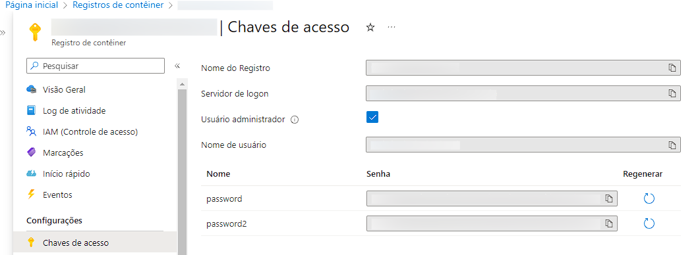
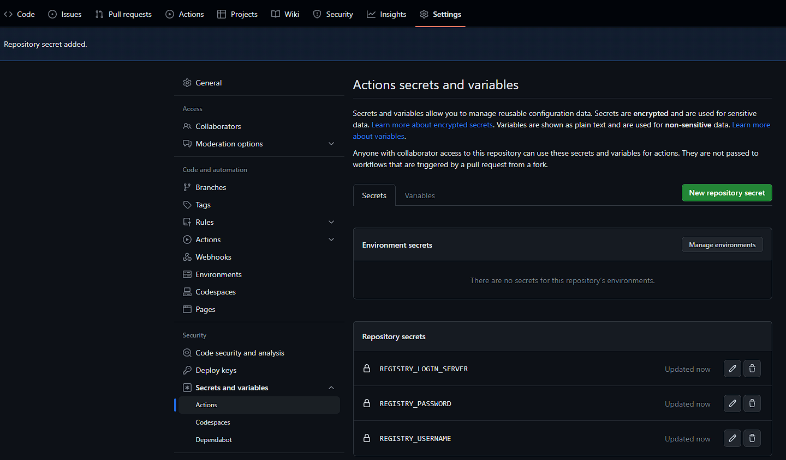
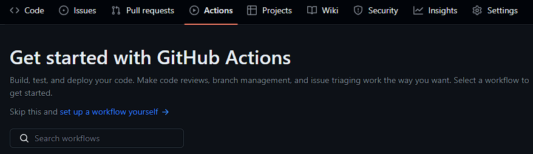
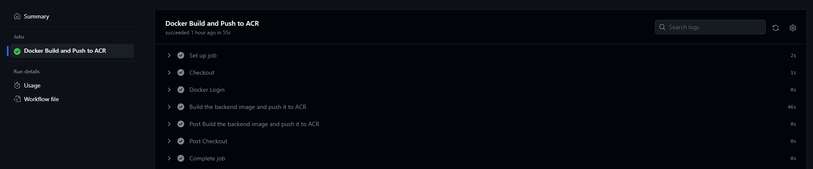
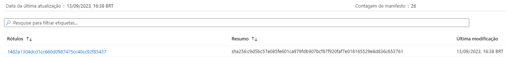

# Armazenando imagens Docker para Azure Container Registry usando o GitHub Actions

Como você pode armazenar imagens Docker para o Azure Container Registry (ACR) usando GitHub Actions.

Caso ainda não tenha um Azure Container Registry, você pode criá-lo usando o [portal do Azure](https://learn.microsoft.com/pt-br/azure/container-registry/container-registry-get-started-portal?tabs=azure-cli) ou usando a [CLI do Azure](https://learn.microsoft.com/pt-br/azure/container-registry/container-registry-get-started-azure-cli).

## Adicionar ao repositório do GitHub as credenciais do ACR

Para permitir que a ação do GitHub crie e implemente com êxito a imagem no Registro de contêineres do Azure, precisamos adicionar alguns repository secrets do GitHub.

Na Página inicial procure por ****Registros de contêiner →**** Selecione o Registro de contêiner do Azure que você criou → **Chaves de acesso** nas Configurações



**Observação:** Autorizaremos o GitHub Actions usando as credenciais de administrador do Azure Container Registry habilitando a opção **Usuário administrador**, mas podem ser usadas outras alternativas como o [Service principal](https://jadsonalves.com.br/como-criar-service-principal-no-azure-utilizando-o-portal-e-powershell/) e [Managed identities](https://jadsonalves.com.br/azure-managed-identities/)

Vamos adicionar 3 repository secrets conforme abaixo, a partir da guia de **chaves de acesso** acima:

- **REGISTRY_LOGIN_SERVER** – Servidor de logon
- **REGISTRY_USERNAME** – Nome de usuário
- **REGISTRY_PASSWORD** – password

Para adicionar secrets no GitHub :

No repositório desejado → Selecione a aba **Settings →** Na guia **Security n**o menu dropdown **Secrets and variables** selecione **Actions → New repository secret**



## Adicionar a GitHub Action ao repositório

Agora, crie um arquivo main.yaml no seu repositório em: `.github/workflows` ou selecione à aba Actions, e acima da barra de pesquisa, clique em **set up a workflow yourself →**



Adicione a GitHub Action abaixo:

```yaml
name: Build and Push to Azure Container Registry
 
on:
  workflow_dispatch:
 push:
  branches:
   - main
 
jobs:
  docker_build_push_acr:
    name: 'Docker Build and Push to ACR'
    runs-on: ubuntu-latest
    environment: production
  
    # Usa o Bash independentemente de ser ubuntu-latest, macos-latest ou windows-latest
    defaults:
      run:
        shell: bash
  
    steps:
    - name: Checkout
      uses: actions/checkout@v3
  
    - name: 'Docker Login'
      uses: azure/docker-login@v1
      with:
        login-server: ${{ secrets.REGISTRY_LOGIN_SERVER }}
        username: ${{ secrets.REGISTRY_USERNAME }}
        password: ${{ secrets.REGISTRY_PASSWORD }}
 
    - name: Build the frontend image and push it to ACR
      uses: docker/build-push-action@v5
      with:
        push: true
        tags: ${{ secrets.REGISTRY_LOGIN_SERVER }}/dockerimagename:${{ github.sha }}
        file: Dockerfile
```

**Atenção** para mudar o valor de `tags` e `enviroment` como desejar, e quando a pipeline irá rodar configurando o `workflow_dispatch`, neste arquivo está configurado para rodar no comando push ****na branch main.

Se a Action for bem-sucedido, o resultado será como abaixo:



E na guia **Repósitorios em Serviços** do Registro de contêiner Azure que você criou estará a sua imagem pronta para deploy:



[Azure Container Registry — Armazenando imagens e artefatos](https://renicius-pagotto.medium.com/azure-container-registry-armazenando-imagens-e-artefatos-d885df6549e3)

[How to Build and Push Dockerized Applications to the Azure Registry](https://www.freecodecamp.org/news/how-to-build-and-push-dockerized-applications-to-azure-registry/)

[Container Registry Best Practices](https://github.com/MicrosoftDocs/azure-docs/blob/main/articles/container-registry/container-registry-best-practices.md)
