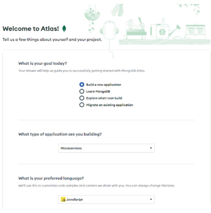
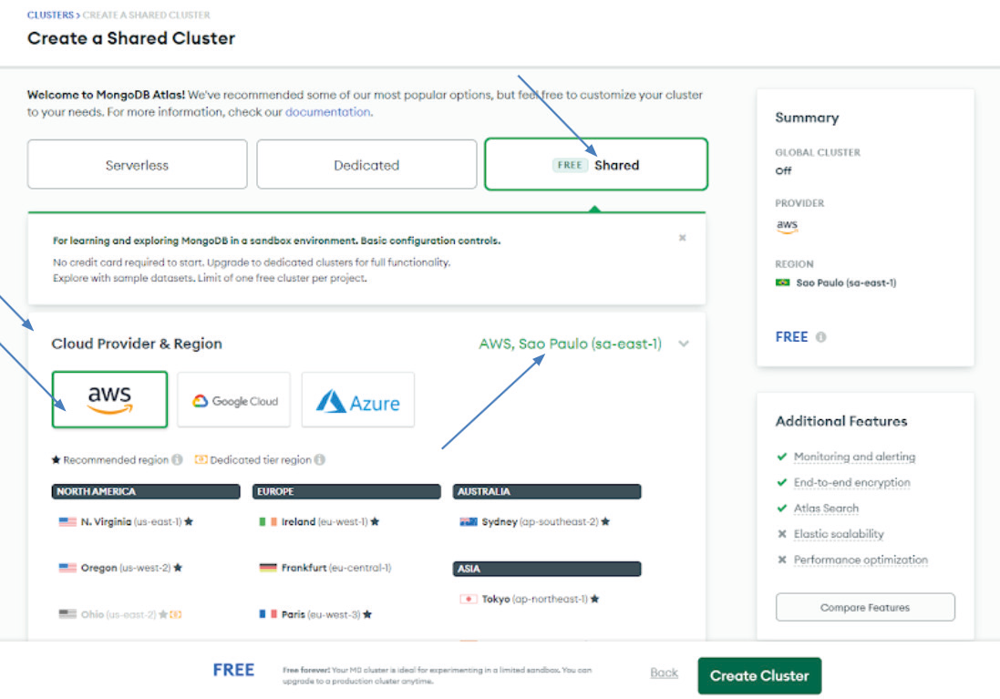

# MongoDB, Mongoose e REST com Node.js

## Introdução

Antes de mergulharmos nos intricados detalhes do MongoDB, Mongoose e REST, é fundamental entendermos as bases dessas tecnologias. Neste artigo, exploraremos desde a instalação do SGBD MongoDB na nuvem até a criação de esquemas utilizando o pacote Mongoose, finalizando com uma imersão nos fundamentos da arquitetura REST. Vamos iniciar essa jornada!

## MongoDB: Unindo Relacional e NoSQL

O MongoDB, desenvolvido para integrar características de bancos de dados relacionais e NoSQL, proporciona agilidade com o uso de esquemas flexíveis e facilita a escalabilidade horizontal. Diferentemente de SGBDs tradicionais, como MySQL e PostgreSQL, o MongoDB oferece uma abordagem inovadora. O MongoDB Atlas, apresentado neste módulo, é um serviço global de banco de dados em nuvem criado pela equipe responsável pelo MongoDB, permitindo a implantação e gerenciamento simplificado.

### Instalação e Configuração do MongoDB na Nuvem

Destacando o MongoDB Atlas, exploraremos os passos para configurar um banco de dados na nuvem. Acesse [https://www.mongodb.com/atlas/database](https://www.mongodb.com/atlas/database), clique em "Try Free" e preencha os dados solicitados ou utilize sua conta do Google para o cadastro. Em seguida, escolha as opções adequadas às suas necessidades, como mostrado na Figura.



Na etapa seguinte, selecione a opção "Shared" para implantação gratuita. Após criar um cluster, certifique-se de escolher a opção "M0 Sandbox" para o nível gratuito. Este processo pode levar de 3 a 5 minutos. Após a conclusão, acesse "Database Access", adicione um novo usuário e configure o acesso externo pelo menu "Network Access". Obtendo a string de conexão, você está pronto para integrar o MongoDB à sua aplicação Node.js.



## Pacote Mongoose: Facilitando a Interação

O NoSQL trouxe flexibilidade aos bancos de dados, e o MongoDB, em particular, tornou-se ideal para armazenar documentos JSON não estruturados. Aqui é onde o Mongoose entra em cena. O pacote Mongoose, uma ferramenta para aplicativos Node.js, permite definir esquemas, garantindo a consistência dos dados e abstraindo o acesso ao MongoDB.

### Conectando o MongoDB ao Node.js com Mongoose

Ao criar uma aplicação Node.js que se conecta ao cluster do MongoDB Atlas, utilizamos o método `connect` do Mongoose. Este método retorna uma promessa, e lidamos com ela usando `then` para sucesso e `catch` para detectar erros. Um exemplo prático desse processo é demonstrado no código a seguir:

```jsx
const mongoose = require('mongoose');
const uri = 'sua-string-de-conexao';

mongoose.connect(uri, { useNewUrlParser: true, useUnifiedTopology: true })
  .then(() => console.log('A conexão com o MongoDB foi realizada com sucesso!'))
  .catch(err => console.error(`Erro na conexão: ${err}`));
```

## Criando um Esquema com Mongoose

Embora o MongoDB seja um banco de dados sem esquema, o Mongoose permite definir esquemas para uma coleção. Vejamos um exemplo de esquema para usuários:

```jsx
const mongoose = require('mongoose');
const Schema = mongoose.Schema;

const UsuarioEsquema = new Schema({
  nome: String,
  login: String,
  senha: String
});

module.exports = mongoose.model('Usuario', UsuarioEsquema);
```

Este esquema é exportado para ser utilizado em outros projetos, seguindo uma prática comum de desenvolvimento Node.js e MongoDB.

## Arquitetura REST: Integrando o Mundo Digital

Vivemos em um mundo conectado, e as APIs são a chave para integrar essa complexidade. Uma API (Interface de Programação de Aplicação) é um contrato entre softwares, permitindo que aplicativos se comuniquem e realizem operações de negócios. No contexto das APIs, destaca-se o padrão REST (Representational State Transfer).

### Fundamentos da API REST

O REST, projetado para aproveitar os protocolos HTTP, é flexível e não está vinculado a recursos ou métodos específicos. As APIs REST possibilitam operações CRUD (Create, Read, Update, Delete) e utilizam métodos HTTP como GET, POST, PUT e DELETE.

### Métodos HTTP na API REST

- **GET**: Recupera informações de um recurso.
- **POST**: Cria um novo recurso.
- **PUT**: Atualiza um recurso existente.
- **DELETE**: Remove um recurso.

### Criando Rotas RESTful com Express.js

O Express.js, um framework web para Node.js, simplifica a criação de aplicativos web e APIs. Vamos criar rotas RESTful básicas utilizando o Express.js. Primeiramente, instale o Express.js em seu projeto:

```bash
npm install express
```

A seguir, um exemplo de configuração básica de rotas utilizando o Express.js:

```jsx
const express = require('express');
const app = express();
const port = 3000;

// Rota GET
app.get('/', (req, res) => res.send('Olá, mundo!'));

// Rota POST
app.post('/usuarios', (req, res) => {
  // Lógica para criar um novo usuário
  res.send('Usuário criado com sucesso!');
});

// Rota PUT
app.put('/usuarios/:id', (req, res) => {
  // Lógica para atualizar um usuário pelo ID
  res.send('Usuário atualizado com sucesso!');
});

// Rota DELETE
app.delete('/usuarios/:id', (req, res) => {
  // Lógica para excluir um usuário pelo ID
  res.send('Usuário excluído com sucesso!');
});

app.listen(port, () => console.log(`O servidor está rodando em http://localhost:${port}`));
```

## Conclusão

Neste artigo, exploramos desde a instalação do MongoDB na nuvem até a criação de esquemas utilizando o Mongoose, finalizando com a criação de rotas RESTful com o Express.js. Essas tecnologias, quando combinadas, proporcionam uma base sólida para o desenvolvimento de aplicativos modernos. Continuaremos a jornada em artigos subsequentes, explorando tópicos avançados, boas práticas e estratégias de segurança. Até lá, bons estudos e prática constante!

## Referências

- MONGODB. Introduction to MongoDB. MongoDB, Inc., New York (NY, USA), 2020? Disponível em: [https://www.mongodb.com/docs/manual/introduction](https://www.mongodb.com/docs/manual/introduction). Acesso em: 25 jul. 2022.
- MONGODB. MongoDB Atlas Tutorial. MongoDB, Inc., New York (NY, USA), 2021? Disponível em: [https://www.mongodb.com/basics/mongodb-atlas-tutorial](https://www.mongodb.com/basics/mongodb-atlas-tutorial). Acesso em: 01 ago. 2022.
- MONGOOSEJS. Getting Started. Mongoose ODM, 2022. Disponível em: [https://mongoosejs.com/docs/index.html](https://mongoosejs.com/docs/index.html). Acesso em: 30 jul. 2022.
- POSTMAN. Introduction. Postman HQ, San Francisco (CA, USA), 5 jul. 2022. Disponível em: [https://learning.postman.com/docs/getting-started/introduction](https://learning.postman.com/docs/getting-started/introduction). Acesso em: 05 ago. 2022.
- RUBY, S.; RICHARDSON, L. Restful web services. Sebastopol (CA, USA): O'Reilly Media, 2007.
- SAUDATE, A. REST: construa APIs inteligentes de maneira simples. São Paulo (SP): Casa do Código, 2014.
